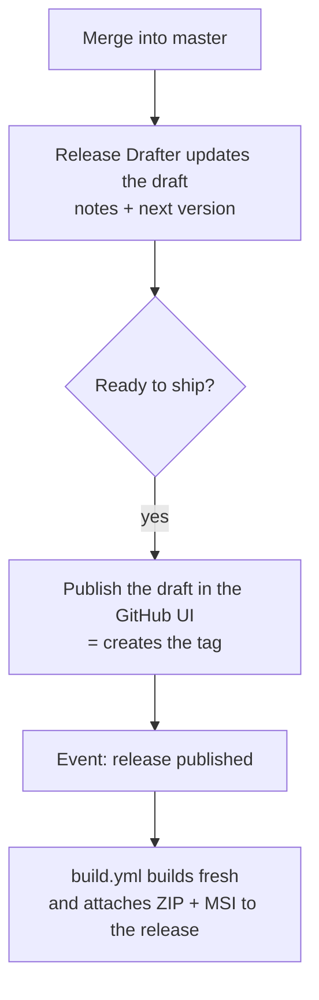
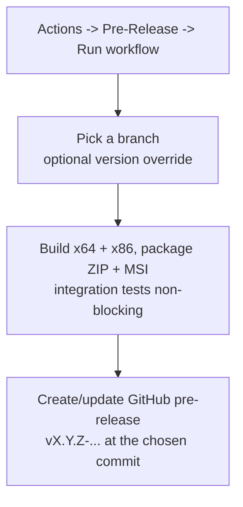

# Releasing DeGhoster

DeGhoster has **no** dedicated `release.yml`. Releases come out of the interplay of
three workflows under `.github/workflows/`. Versioning is driven end-to-end by
GitVersion (`build/version.json`, `fullSemVer`).

## Workflows at a glance

| Workflow | File | Trigger | What it does |
|---|---|---|---|
| **Build** | `build.yml` | PR to `master`, push to `master`, **and** `release: published` | Builds x64 + x86, packages ZIP + MSI (`build.ps1 -PackageOnly`), runs the integration tests, uploads artifacts. On a *published* release it also attaches the ZIP + MSI to that release. |
| **Release Drafter** | `release-drafter.yml` | push to `master`, PR events | Keeps a **draft** release up to date: generated notes (categorized by PR labels via `.github/release-drafter.yml`) and the next version. Never publishes on its own. |
| **Pre-Release** | `prerelease.yml` | manual `workflow_dispatch` (any branch), optional `version` input | Builds x64 + x86, packages ZIP + MSI, runs the integration tests (non-blocking), then creates/updates a GitHub **pre-release** `vX.Y.Z-…` targeting the current commit. |

## Stable release flow

A stable release is **not** produced automatically on push. The draft is kept
current, but *publishing* it is a manual step that then triggers the asset build.

Steps:
1. Merge the changes into `master`. Release Drafter refreshes the draft release
   (notes + computed next version).
2. When ready, open the draft in **Releases** and **Publish** it. Publishing sets
   the tag (e.g. `v0.0.5`).
3. Publishing fires `build.yml`'s `release: published` path, which builds the
   binaries and uploads the ZIP + MSI onto the release with
   `gh release upload --clobber`.

## Pre-release flow

Completely separate from the draft/stable path — for handing out a test build.

Steps:
1. In the Actions tab, run **Pre-Release** → **Run workflow**, choose the branch,
   and optionally set `version` (e.g. `0.0.5-rc.1`; empty = derived from the
   branch via GitVersion).
2. It publishes a GitHub release marked **pre-release** with the ZIP + MSI at the
   selected commit, without touching the draft or any stable release.

Safety: if a *non*-pre-release already exists under the same tag, the workflow
refuses to overwrite it.

## Pre-release vs. release in one line

- **Pre-release:** you trigger it (`workflow_dispatch`), from any branch, and get
  an immediate pre-release artifact to test or share.
- **Release:** not automatic on push — the draft is maintained, but **publishing
  is a manual step** in the UI, which then lets `build.yml` attach the final
  assets.
