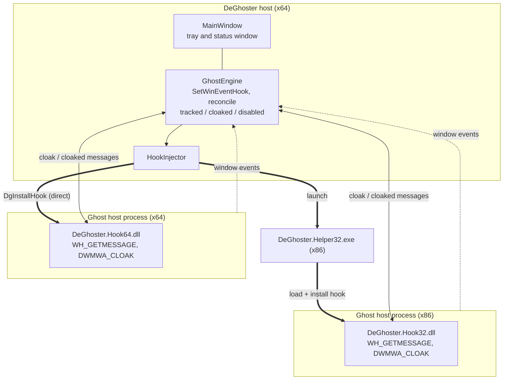

# DeGhoster — Architecture

How DeGhoster is built internally. For *what* it must do see
[Specification.md](Specification.md); for *why* the key choices were made see the
[ADRs](adr/README.md); for building/packaging see [Build.md](Build.md).

## Overview

DeGhoster is a native Win32 C++ application with no runtime dependencies
([ADR-0001](adr/0001-native-win32-cpp.md)). An x64 **host** does all detection, UI
and orchestration; the actual neutralization runs **inside** each target process via
an injected **hook DLL** ([ADR-0002](adr/0002-in-process-cloak-via-hook-dll.md)).

## Components

| Component | Kind | Role |
|---|---|---|
| `DeGhoster` | native Win32 C++ exe (x64) | detection, UI, tray, orchestration |
| `DeGhoster.Hook64.dll` | native C++ (x64) | in-process cloak for x64 targets |
| `DeGhoster.Hook32.dll` | native C++ (x86) | in-process cloak for x86 targets |
| `DeGhoster.Helper32.exe` | native C++ (x86) | injects Hook32 into 32-bit targets |
| `<culture>\DeGhoster.exe.mui` | resource-only | localized `STRINGTABLE` per UI language (MUI satellite) |

## Host source modules (`src/DeGhoster/`)

The host is split into single-responsibility translation units, each with its own
header. Windows use the `this`-via-`GWLP_USERDATA` pattern; DPI is per-window (`S()`),
with no shared mutable state beyond the win-event thunk's single-instance pointer.

| Module | Role |
|---|---|
| `main.cpp` | `wWinMain`, GDI+/common-controls init, message loop; handles the `--register/--unregister-autostart` CLI hooks and exits |
| `MainWindow` | tray app and status window: toolbar, list, tray menu; owns theme/settings/engine, implements `GhostEngine::Listener` |
| `InfoWindow` | dark-mode "About" popup (modeless, single-instance) |
| `GhostEngine` | detection + cloak + reconcile core, driven by `SetWinEventHook` |
| `HookInjector` | loads the hook DLL, injects it per target thread (x64 directly, x86 via Helper32) |
| `Autostart` | per-user HKCU `Run` register/unregister (installer hooks) |
| `Settings` | registry persistence (global switch, per-window opt-outs) |
| `Theme` | color set, OS light/dark detection, immersive dark title bar |
| `Loc` | MUI string loading (`LoadStringW` + cache) and RTL detection |
| `ProcessUtil` | executable dir, WOW64 check, host-exe resolution, window title |
| `Gfx` | GDI+ glyph/circle drawing, GDI+ RAII |
| `HoverButton` | owner-draw button hover subclass |
| `Glyphs`, `Dpi`, `FixInfo`, `AppInfo`, `Version.h` | shared constants and small value types (`Version.h` is generated, see [Build.md](Build.md)) |

## Detection ([ADR-0003](adr/0003-event-driven-detection.md))

The host installs out-of-context `SetWinEventHook`s
(`WINEVENT_OUTOFCONTEXT | WINEVENT_SKIPOWNPROCESS`) and reacts only to relevant
events — no polling.

| Event | Action |
|---|---|
| `EVENT_OBJECT_CREATE` / `SHOW` / `LOCATIONCHANGE` | check candidate → track + reconcile |
| `EVENT_OBJECT_DESTROY` | drop from list |

Only `idObject == OBJID_WINDOW`, `idChild == CHILDID_SELF` events are considered. A
one-time `EnumWindows` scan on startup catches already-open ghosts. The ghost
criteria (including the `LWA_ALPHA` discriminator,
[ADR-0004](adr/0004-lwa-alpha-ghost-discriminator.md)) are defined in
[Specification.md](Specification.md#2-ghost-window-definition).

## Why a ghost eats clicks

An invisible window that still swallows clicks sounds contradictory — normally a fully
transparent (alpha 0) layered window is *click-through*. The real ghost is a
**DirectComposition** window: its ex-styles are `WS_EX_LAYERED | WS_EX_TOOLWINDOW |
WS_EX_NOACTIVATE | WS_EX_NOREDIRECTIONBITMAP` with `SetLayeredWindowAttributes`
`LWA_ALPHA` alpha 0 (captured from a live WhatsApp ghost with `tests/ghost-probe.ps1`:
class `Chrome_WidgetWin_1`, process `msedgewebview2`).

The decisive flag is **`WS_EX_NOREDIRECTIONBITMAP`**. The "alpha 0 lets clicks pass
through" hit-testing is based on the window's *redirection bitmap*; a window rendered
through DirectComposition has **no** redirection bitmap, so that rule doesn't apply and
the window keeps hit-testing its **entire rectangle** while being visually invisible —
it eats every click (and, because it never sets a cursor, the pointer vanishes there).

Cloaking the window (`DWMWA_CLOAK`) takes it out of composition **and** hit-testing, so
clicks fall through to whatever is behind it and the cursor returns — which is exactly
what DeGhoster does. A plain alpha-0 window *without* `WS_EX_NOREDIRECTIONBITMAP` is
click-through and does **not** reproduce the defect; the test ghost
(`tests/GhostSim`, default `WS_EX_NOREDIRECTIONBITMAP`) does, and
`tests/DeGhoster.Tests/ClickThroughProofTests.cs` proves the eat → cloak → pass-through
cycle with a real synthesized click. No WebView2 runtime is needed to reproduce it.

## Neutralization & the host ↔ hook protocol ([ADR-0002](adr/0002-in-process-cloak-via-hook-dll.md))

A ghost is neutralized by cloaking it: `DwmSetWindowAttribute(hwnd, DWMWA_CLOAK=13, 1)`
(`DWM_CLOAKED_APP`), which removes it from composition **and** hit-testing. Because
that only works from inside the owning process, the host injects a `WH_GETMESSAGE`
hook DLL and drives it by posting messages to the ghost window; the DLL acts
in-process and replies to the host window.

| Message | Dir | Value | Meaning |
|---|---|---|---|
| `DGH_CLOAK` | host → dll | `WM_APP+0x10` | cloak target window (`m->hwnd`) |
| `DGH_UNCLOAK` | host → dll | `WM_APP+0x11` | un-cloak target window |
| `WM_DGH_CLOAKED` | dll → host | `WM_APP+0x20` | window cloaked (`wParam = hwnd`) |
| `WM_DGH_UNCLOAKED` | dll → host | `WM_APP+0x21` | window released |

The DLL re-checks the ghost criteria before cloaking and auto-uncloaks all tracked
windows on `DLL_PROCESS_DETACH`.

## Bitness ([ADR-0005](adr/0005-separate-32bit-helper.md))

- **x64 target:** host calls `DgInstallHook(threadId, hostHwnd)` (Hook64) directly.
- **x86 target:** an x64 process cannot load a 32-bit DLL, so the host starts
  `DeGhoster.Helper32.exe <threadId> <hostHwnd> <hostPid>`. The helper loads Hook32,
  installs the hook, and holds it until the host process exits (then `DgRemoveHook` +
  quit).
- Hooks are deduplicated per **thread id**; one helper is spawned per hooked 32-bit
  thread.

## Host-program name resolution

The list shows the owning **host program**, not `msedgewebview2`. The host walks the
parent process chain (Toolhelp snapshot) up from the WebView2 process until the first
non-`msedgewebview2` process, then reads its full image path via
`QueryFullProcessImageName`. Displayed as `Window title (executable.exe)`.

## State model

| Set | Meaning |
|---|---|
| tracked | every live ghost window currently listed |
| cloaked | tracked windows currently cloaked by us |
| disabled | per-window opt-out, key `<ExePath>\|<WindowTitle>` |
| global enabled | master switch |

**Reconcile rule** per window: cloak ⇔ `globalEnabled && managed && windowAlive`,
where `managed = key ∉ disabled`.

- **Global off** disables only the *action*. Detection keeps running, the list stays;
  entries vanish only when the window closes.
- **Per-window off** un-cloaks that window but keeps it listed.

## Persistence (registry)

Root: `HKCU\Software\DeGhoster` (the full executable path, not the process name, is
the stable key part).

| Value | Type | Meaning |
|---|---|---|
| `GlobalEnabled` | DWORD | master switch |
| `Disabled\<ExePath>\|<Title>` | String | one value per disabled window |

The per-user autostart entry (`...\CurrentVersion\Run\DeGhoster`) is managed by the
installer / the `Autostart` module, see [ADR-0007](adr/0007-per-user-autostart.md).

## UI rendering

- Owner-drawn toolbar buttons and list cells via GDI+; icons are glyphs from the
  "Segoe MDL2 Assets" system font.
- The global power button and each row's per-window switch are drawn identically — a
  filled circle (green = on/managed via `Theme::accentOn`, grey = off via
  `accentOff`) with a glyph on top (power / open-eye / crossed-eye). A 1px-wide
  image list forces a taller list row so the per-row eye reads clearly.
- DPI-aware (per-monitor v2); follows the Windows light/dark theme; renders per-OS
  (Win 10 look on Win 10, Win 11 on Win 11) via comctl32 v6 theming and DWM.

## Localization internals ([ADR-0006](adr/0006-mui-localization.md))

`rcconfig.xml` (UTF-16) drives the `muirct` split:
`<localizedResources><resourceType typeNameId="#6"/>` moves `RT_STRING` (6) to the
`.mui`; icon/group-icon/manifest **and the `VERSIONINFO` (type 16)** stay in the
neutral module. `cmake/Languages.cmake` (`<culture>=<LANGID>=<rc>`) is the single
source of truth; `strings_<lang>.rc` holds the translations. RTL (ar/he):
`Loc::isRtl()` reads `LOCALE_IREADINGLAYOUT` of the resolved UI language, windows use
`WS_EX_LAYOUTRTL`, and owner-drawn glyphs are kept upright via `SetLayout(hdc, 0)`.
Brand strings (app name, tagline, "Buy Me a Coffee", "OK", copyright) stay English
and are not in the table.

## Dependencies

None beyond Windows system libraries: `comctl32`, `dwmapi`, `uxtheme`, `gdiplus`,
`shell32`, `user32`, `gdi32`. No bundled assets. License: **GNU AGPL v3** (see
`LICENSE`, `NOTICE`).
