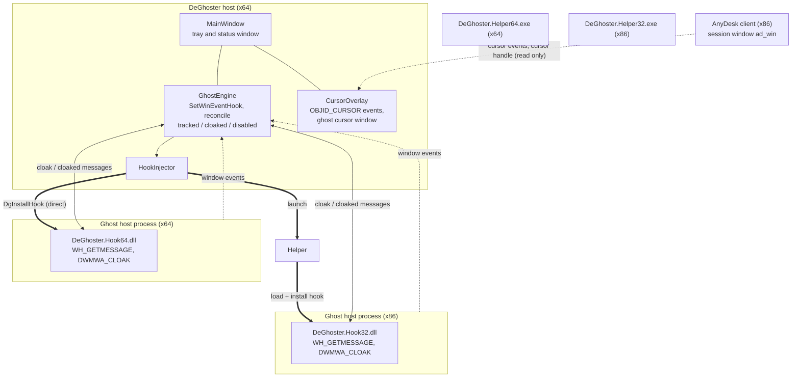
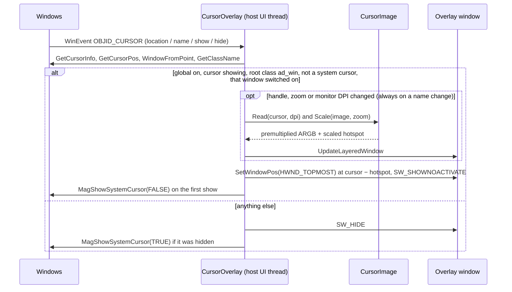

# DeGhoster — Architecture

How DeGhoster is built internally. For *what* it must do see
[Specification.md](Specification.md); for *why* the key choices were made see the
[ADRs](adr/README.md); for building/packaging see [Build.md](Build.md).

## Overview

DeGhoster is a native Win32 C++ application with no runtime dependencies
([ADR-0001](adr/0001-native-win32-cpp.md)). An x64 **host** does all detection, UI
and orchestration; the actual neutralization runs **inside** each target process via
an injected **hook DLL** ([ADR-0002](adr/0002-in-process-cloak-via-hook-dll.md)).
The AnyDesk cursor overlay is the exception: it runs entirely in the host and
touches AnyDesk only by reading its cursor
([ADR-0012](adr/0012-anydesk-cursor-overlay.md), [below](#anydesk-cursor-overlay-adr-0012)).

```mermaid
flowchart TB
    subgraph Host["DeGhoster host (x64)"]
        direction TB
        UI["MainWindow<br/>tray and status window"]
        Engine["GhostEngine<br/>SetWinEventHook, reconcile<br/>tracked / cloaked / disabled"]
        Inj["HookInjector"]
        Overlay["CursorOverlay<br/>OBJID_CURSOR events,<br/>ghost cursor window"]
    end

    AnyDesk["AnyDesk client (x86)<br/>session window ad_win"]

    Helper64["DeGhoster.Helper64.exe (x64)"]
    Helper32["DeGhoster.Helper32.exe (x86)"]

    subgraph T64["Ghost host process (x64)"]
        H64["DeGhoster.Hook64.dll<br/>WH_GETMESSAGE, DWMWA_CLOAK"]
    end

    subgraph T32["Ghost host process (x86)"]
        H32["DeGhoster.Hook32.dll<br/>WH_GETMESSAGE, DWMWA_CLOAK"]
    end

    T64 -. "window events" .-> Engine
    T32 -. "window events" .-> Engine
    UI --- Engine
    UI --- Overlay
    AnyDesk -. "cursor events, cursor handle (read only)" .-> Overlay
    Engine --> Inj
    Inj == "DgInstallHook (direct)" ==> H64
    Inj == "launch" ==> Helper
    Helper == "load + install hook" ==> H32
    Engine <-- "cloak / cloaked messages" --> H64
    Engine <-- "cloak / cloaked messages" --> H32
```

## Components

| Component | Kind | Role |
|---|---|---|
| `DeGhoster` | native Win32 C++ exe (x64) | detection, UI, tray, orchestration |
| `DeGhoster.Hook64.dll` | native C++ (x64) | in-process cloak for x64 targets |
| `DeGhoster.Hook32.dll` | native C++ (x86) | in-process cloak for x86 targets |
| `DeGhoster.Helper64.exe` | native C++ (x64) | injects Hook64 into 64-bit targets, watchdogs the hook |
| `DeGhoster.Helper32.exe` | native C++ (x86) | injects Hook32 into 32-bit targets, watchdogs the hook |
| `<culture>\DeGhoster.exe.mui` | resource-only | localized `STRINGTABLE` per UI language (MUI satellite) |

## Host source modules (`src/DeGhoster/`)

The host is split into single-responsibility translation units, each with its own
header. Windows use the `this`-via-`GWLP_USERDATA` pattern; DPI is per-window (`S()`),
with no shared mutable state beyond the win-event thunk's single-instance pointer.

| Module | Role |
|---|---|
| `main.cpp` | `wWinMain`, GDI+/common-controls init, message loop; handles the `--register/--unregister-autostart` CLI hooks (and exits) and the `--taskbar` flag (start hidden in the tray, used by autostart) |
| `MainWindow` | tray app and status window: toolbar, list, tray menu; owns theme/settings/engine/overlay, implements `GhostEngine::Listener`, forwards the zoom, the global switch, per-window changes and session lock/unlock to the overlay and gives it the per-window filter |
| `InfoWindow` | dark-mode "About" popup (modeless, single-instance) |
| `SettingsWindow` | settings window (modeless, single-instance), built in sections; applies and saves every change at once and tells the owner with `WM_SETTINGS_CHANGED` |
| `Controls` | owner-drawn slider used by the settings window |
| `CursorOverlay` | AnyDesk cursor overlay: `OBJID_CURSOR` WinEvents, activation check (asks the per-window filter), overlay window, `MagShowSystemCursor` |
| `CursorImage` | cursor handle → premultiplied ARGB + hotspot (all three cursor kinds), outline for inverting pixels, sharp-bilinear scaling |
| `GhostEngine` | detection + cloak + reconcile core for every case (ghosts and AnyDesk windows), driven by `SetWinEventHook` |
| `HookInjector` | starts a helper of the target's bitness per target thread and tracks its lifetime |
| `Autostart` | per-user HKCU `Run` register/unregister (installer hooks) |
| `Settings` | registry persistence (global switch, per-window opt-outs, cursor overlay zoom) |
| `Theme` | color set, OS light/dark detection, immersive dark title bar |
| `Loc` | MUI string loading (`LoadStringW` + cache) and RTL detection |
| `ProcessUtil` | executable dir, WOW64 check, host-exe resolution, window title |
| `Gfx` | GDI+ glyph/circle/pill drawing, GDI+ RAII |
| `HoverButton` | owner-draw button hover subclass |
| `Glyphs`, `Dpi`, `FixInfo`, `AppInfo`, `Version.h` | shared constants and small value types (`Version.h` is generated, see [Build.md](Build.md)) |

## Detection ([ADR-0003](adr/0003-event-driven-detection.md))

The host installs out-of-context `SetWinEventHook`s
(`WINEVENT_OUTOFCONTEXT | WINEVENT_SKIPOWNPROCESS`) and reacts only to relevant
events — no polling.

| Event | Action |
|---|---|
| `EVENT_OBJECT_CREATE` / `SHOW` / `LOCATIONCHANGE` | check candidate → track + reconcile |
| `EVENT_OBJECT_SHOW` / `HIDE` of a tracked window | update its *hidden* mark |
| `EVENT_OBJECT_DESTROY` | drop from list |

Only `idObject == OBJID_WINDOW`, `idChild == CHILDID_SELF` events are considered. A
one-time `EnumWindows` scan on startup catches already-open windows. A candidate is
tracked as one of two kinds (`FixInfo::Kind`):

- **Ghost** — the ghost criteria (including the `LWA_ALPHA` discriminator,
  [ADR-0004](adr/0004-lwa-alpha-ghost-discriminator.md)) are defined in
  [Specification.md](Specification.md#2-ghost-window-definition). Only ghosts are
  reconciled, i.e. cloaked through a hook.
- **AnyDesk** — a visible top-level window of class `ad_win` (up to the first `#`).
  Nothing is done to it; the cursor overlay asks the engine (`trackAnyDesk`) whether
  the window under the cursor is tracked and switched on. `trackAnyDesk` also tracks a
  window its events have not reported yet.

The one-second `tick()` drops a window only when it is destroyed or, for a ghost,
stops meeting the ghost criteria. Visibility is deliberately not one of them: a
ghost its app hid (minimized) stays tracked and neutralized, marked `hidden` and
drawn greyed out in the list, until it is destroyed.

## Why a ghost eats clicks

An invisible window that still swallows clicks sounds contradictory — normally a fully
transparent (alpha 0) layered window is *click-through*. The real ghost is a
**DirectComposition** window: its ex-styles are `WS_EX_LAYERED | WS_EX_TOOLWINDOW |
WS_EX_NOACTIVATE | WS_EX_NOREDIRECTIONBITMAP` with `SetLayeredWindowAttributes`
`LWA_ALPHA` alpha 0 (captured from a live WhatsApp ghost with `tests/ghost-probe.ps1`:
class `Chrome_WidgetWin_1`, process `msedgewebview2`).

The decisive flag is **`WS_EX_NOREDIRECTIONBITMAP`**. The "alpha 0 lets clicks pass
through" hit-testing is based on the window's *redirection bitmap*; a window rendered
through DirectComposition has **no** redirection bitmap, so that rule doesn't apply and
the window keeps hit-testing its **entire rectangle** while being visually invisible —
it eats every click (and, because it never sets a cursor, the pointer vanishes there).

Cloaking the window (`DWMWA_CLOAK`) takes it out of composition **and** hit-testing, so
clicks fall through to whatever is behind it and the cursor returns — which is exactly
what DeGhoster does. A plain alpha-0 window *without* `WS_EX_NOREDIRECTIONBITMAP` is
click-through and does **not** reproduce the defect; the test ghost
(`tests/GhostSim`, default `WS_EX_NOREDIRECTIONBITMAP`) does, and
`tests/DeGhoster.Tests/ClickThroughProofTests.cs` proves the eat → cloak → pass-through
cycle with a real synthesized click. No WebView2 runtime is needed to reproduce it.

## Neutralization & the host ↔ hook protocol ([ADR-0002](adr/0002-in-process-cloak-via-hook-dll.md))

A ghost is neutralized by cloaking it: `DwmSetWindowAttribute(hwnd, DWMWA_CLOAK=13, 1)`
(`DWM_CLOAKED_APP`), which removes it from composition **and** hit-testing. Because
that only works from inside the owning process, the host injects a `WH_GETMESSAGE`
hook DLL and drives it by posting messages to the ghost window; the DLL acts
in-process and replies to the host window.

| Message | Dir | Value | Meaning |
|---|---|---|---|
| `DGH_CLOAK` | host → dll | `WM_APP+0x10` | cloak target window (`m->hwnd`) |
| `DGH_UNCLOAK` | host → dll | `WM_APP+0x11` | un-cloak target window |
| `WM_DGH_CLOAKED` | dll → host | `WM_APP+0x20` | window cloaked (`wParam = hwnd`) |
| `WM_DGH_UNCLOAKED` | dll → host | `WM_APP+0x21` | window released |

The DLL re-checks the ghost criteria before cloaking and auto-uncloaks all tracked
windows on `DLL_PROCESS_DETACH`.

## Bitness ([ADR-0011](adr/0011-helper-per-bitness.md))

The host never loads a hook DLL itself. Every target is injected the same way, only
the helper differs:

- The host starts `DeGhoster.Helper<bits>.exe <threadId> <hostHwnd> <hostPid>`, picked
  by the target's bitness (`IsWow64Process`), because a hook DLL must match the
  bitness of the thread it is installed on.
- The helper loads the matching hook DLL, installs the hook and signals
  `Local\DeGhoster.HelperReady.<hostPid>.<threadId>`; only then does the host post
  `DGH_CLOAK`, so the command cannot arrive before the hook is live.
- The helper then waits on **both** the host process and the hooked thread. When
  either ends it removes the hook, nudges the target so the loader unmaps the DLL, and
  quits — so a hard-killed host leaves nothing behind.
- Because the hook is not live when the helper is started, `ensure()` reports
  `Ready`/`Pending`/`Failed` and the periodic tick re-drives whatever is pending,
  instead of blocking the UI thread.
- Hooks are deduplicated per **thread id** (pinned to the thread's creation time, so a
  recycled id is not mistaken for a live hook); one helper per hooked thread.

## Host-program name resolution

The list shows the owning **host program**, not `msedgewebview2`. The host walks the
parent process chain (Toolhelp snapshot) up from the WebView2 process until the first
non-`msedgewebview2` process, then reads its full image path via
`QueryFullProcessImageName`. Displayed as `Window title (executable.exe)`.

## AnyDesk cursor overlay ([ADR-0012](adr/0012-anydesk-cursor-overlay.md))

AnyDesk sets the remote cursor as an ordinary Win32 cursor on its session window,
already shrunk. `CursorOverlay` shows an enlarged copy in a window of its own and
hides the small original; the requirements are in
[Specification.md](Specification.md#10-anydesk-remote-cursor).

```mermaid
sequenceDiagram
    participant W as Windows
    participant O as CursorOverlay (host UI thread)
    participant I as CursorImage
    participant V as Overlay window
    W->>O: WinEvent OBJID_CURSOR (location / name / show / hide)
    O->>W: GetCursorInfo, GetCursorPos, WindowFromPoint, GetClassName
    alt global on, cursor showing, root class ad_win, not a system cursor, that window switched on
        opt handle, zoom or monitor DPI changed (always on a name change)
            O->>I: Read(cursor, dpi) and Scale(image, zoom)
            I-->>O: premultiplied ARGB + scaled hotspot
            O->>V: UpdateLayeredWindow
        end
        O->>V: SetWindowPos(HWND_TOPMOST) at cursor − hotspot, SW_SHOWNOACTIVATE
        O->>W: MagShowSystemCursor(FALSE) on the first show
    else anything else
        O->>V: SW_HIDE
        O->>W: MagShowSystemCursor(TRUE) if it was hidden
    end
```

- **Events.** One out-of-context `SetWinEventHook` for `EVENT_OBJECT_SHOW` …
  `EVENT_OBJECT_NAMECHANGE`; the callback drops everything that is not
  `OBJID_CURSOR` straight away. Unlike the ghost detection it does **not** skip the
  own process: cursor events are raised for the process under the cursor, and missing
  them while the mouse moves from AnyDesk onto a DeGhoster window would strand the
  overlay there with the real cursor hidden. The hook exists only while the global
  switch is on.
- **Activation.** `CURSOR_SHOWING` stays set while DeGhoster itself hides the cursor
  with `MagShowSystemCursor`, but is cleared when someone else hides it (the Windows
  Magnifier's full-screen mode), so the flag can be required unconditionally. The
  root window under the cursor must have the class `ad_win` (compared up to the first
  `#`), and the cursor must not be one of the `LoadCursor(NULL, IDC_*)` handles.
- **Image.** `GetIconInfo` + `GetDIBits` as top-down 32-bit pixels; colour with alpha
  is used as is, colour without alpha and monochrome cursors are decoded through the
  AND/XOR masks. Inverting pixels become black with a white outline of radius
  `max(1, round(DPI/96 × 0.8))`; the canvas grows by that radius so the outline is
  never cut off. Scaling is sharp bilinear on premultiplied pixels with clamped
  edges.
- **Window.** `WS_EX_LAYERED | WS_EX_TRANSPARENT | WS_EX_TOPMOST | WS_EX_NOACTIVATE |
  WS_EX_TOOLWINDOW`, class `DeGhosterCursorOverlay`; `WM_NCHITTEST` answers
  `HTTRANSPARENT` and `WM_MOUSEACTIVATE` `MA_NOACTIVATE`. Every move re-asserts
  `HWND_TOPMOST`, so the taskbar cannot clip it.
- **Hidden cursor.** A cursor AnyDesk sets while the real one is hidden can get
  drawn once and stay frozen on screen (seen with a Mac remote's resize cursors)
  until a click refreshes it. After every new shape the overlay therefore calls
  `MagShowSystemCursor(TRUE)` and `FALSE` back to back, which makes Windows drop the
  stale image without a visible flicker.
- **Per window.** Each AnyDesk window is a tracked case with its own eye. The overlay
  gets a filter from `MainWindow` that looks the root window up with
  `GhostEngine::trackAnyDesk` and checks its opt-out key; toggling an eye calls
  `CursorOverlay::refresh()`, so a window switched off under the cursor loses the
  overlay at once.
- **Lifecycle.** `MainWindow` pushes `globalEnabled` and the zoom after every change; `WTS_SESSION_LOCK` hides the overlay and restores the
  cursor, `WTS_SESSION_UNLOCK` leaves it to the next cursor event. `WM_ENDSESSION` and
  `WM_DESTROY` destroy the overlay, which restores the cursor and calls
  `MagUninitialize`. A killed process gets its cursor back from Windows.

## State model

| Set | Meaning |
|---|---|
| tracked | every live window of every case currently listed (ghosts and AnyDesk windows, hidden ones included) |
| cloaked | tracked ghosts currently cloaked by us |
| disabled | per-window opt-out, key `<ExePath>\|<WindowTitle>` |
| global enabled | master switch |

**Reconcile rule** per window: cloak ⇔ `globalEnabled && managed && windowAlive`,
where `managed = key ∉ disabled`.

- **Global off** disables only the *action*. Detection keeps running, the list stays;
  entries vanish only when the window closes.
- **Per-window off** un-cloaks that window but keeps it listed.

## Persistence (registry)

Root: `HKCU\Software\DeGhoster` (the full executable path, not the process name, is
the stable key part).

| Value | Type | Meaning |
|---|---|---|
| `GlobalEnabled` | DWORD | master switch |
| `Disabled\<ExePath>\|<Title>` | String | one value per disabled window |
| `CursorOverlayZoom` | DWORD | overlay zoom in percent, 100 … 600 on a 10 % grid; written on first start from the primary monitor's scaling |

The per-user autostart entry (`...\CurrentVersion\Run\DeGhoster`) is managed by the
installer / the `Autostart` module, see [ADR-0007](adr/0007-per-user-autostart.md).

## UI rendering

- Owner-drawn toolbar buttons and list cells via GDI+; icons are glyphs from the
  "Segoe MDL2 Assets" system font.
- The global power button and each row's per-window switch are drawn identically — a
  filled circle (green = on/managed via `Theme::accentOn`, grey = off via
  `accentOff`) with a glyph on top (power / open-eye / crossed-eye). A 1px-wide
  image list forces a taller list row so the per-row eye reads clearly.
- DPI-aware (per-monitor v2); follows the Windows light/dark theme; renders per-OS
  (Win 10 look on Win 10, Win 11 on Win 11) via comctl32 v6 theming and DWM.
- The settings window measures its text and grows with long translations (up to the
  monitor's work area) and re-measures on `WM_DPICHANGED`. Its controls
  (`Controls.cpp`) are custom window classes: the slider draws a track, a thumb and
  a value label. It is keyboard operable (`WM_GETDLGCODE`, driven by
  `IsDialogMessage` in the main loop), greys out when disabled and show a focus rectangle following the keyboard cues
  (`UISF_HIDEFOCUS`).

## Localization internals ([ADR-0006](adr/0006-mui-localization.md))

`rcconfig.xml` (UTF-16) drives the `muirct` split:
`<localizedResources><resourceType typeNameId="#6"/>` moves `RT_STRING` (6) to the
`.mui`; icon/group-icon/manifest **and the `VERSIONINFO` (type 16)** stay in the
neutral module. `cmake/Languages.cmake` (`<culture>=<LANGID>=<rc>`) is the single
source of truth; `strings_<lang>.rc` holds the translations. RTL (ar/he):
`Loc::isRtl()` reads `LOCALE_IREADINGLAYOUT` of the resolved UI language, windows use
`WS_EX_LAYOUTRTL`, and owner-drawn glyphs are kept upright via `SetLayout(hdc, 0)`.
GDI+ ignores a mirrored DC, so the slider keeps its geometry and
mouse positions in logical (mirrored) coordinates but paints after `SetLayout(hdc, 0)`
with every rectangle mirrored by hand; under RTL the arrow keys follow the visual
direction.
Brand strings (app name, tagline, "Buy Me a Coffee", "OK", copyright) stay English
and are not in the table.

## Dependencies

None beyond Windows system libraries: `comctl32`, `dwmapi`, `uxtheme`, `gdiplus`,
`shell32`, `user32`, `gdi32`, `magnification` (hiding the small AnyDesk cursor),
`shcore` (per-monitor DPI) and `wtsapi32` (session lock notifications). No bundled
assets. License: **GNU AGPL v3** (see
`LICENSE`, `NOTICE`).
