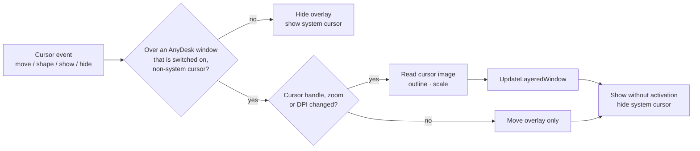

# DeGhoster — Specification

*What* DeGhoster must do — requirements and externally observable behavior. For the
internal design see [Architecture.md](Architecture.md); for the rationale behind the
main choices see the [ADRs](adr/README.md); for building see [Build.md](Build.md).

## 1. Purpose

Some Chromium-based desktop apps (WebView2, Electron) leave an **invisible window**
on screen. When the owning app moves to another virtual desktop, that window stays
behind and, within its rectangle, produces two symptoms:

- **Click-eating** — it intercepts desktop clicks, so clicks in that area do nothing.
- **Cursor disappearance** — it ignores the cursor-setting message (`WM_SETCURSOR`),
  so the mouse pointer vanishes while it is over the window's area.

DeGhoster detects such "ghost windows" and neutralizes them so clicks reach the
desktop again and the cursor is restored.

DeGhoster exists because this is ultimately a defect in the offending applications —
they should destroy or cloak these leftover windows themselves (WhatsApp's desktop
app is a recurring example); until they do, DeGhoster is a pragmatic workaround.

### 1.1 Scope and outlook

Today DeGhoster targets this one, precisely-defined ghost-window defect. But the
invisible and leftover windows that Chromium/WebView2 apps produce can misbehave in
more than one way — swallowing clicks and hiding the cursor are simply the symptoms
seen most often — and the approach behind DeGhoster generalizes well beyond them:
recognize a *well-defined* bad-window pattern and neutralize it **reversibly**,
in-process, without ever touching a legitimate window.

The intention is therefore for DeGhoster to grow over time. As further such issues are
identified and shown to be safely mitigable with the same event-driven, reversible
technique, they are meant to be added here as additional cases. Each addition is
deliberate and held to the same bar: the offending window must be detectable
**precisely** (no false positives against real windows) and neutralizable
**reversibly** (a wrong guess must always be undoable). Anything that cannot meet both
conditions stays out of scope.

The second case added this way is the **tiny AnyDesk remote cursor** on high-DPI
clients (section 10). It is detected precisely (only over an AnyDesk session window
showing AnyDesk's own cursor) and is reversible (nothing in AnyDesk, the remote
machine or Windows is changed; switching it off removes every effect at once).

## 2. Ghost-window definition

A top-level window is treated as a ghost when **all** of the following hold:

| Property | Required value |
|---|---|
| Class name | `Chrome_WidgetWin_1` |
| Visible | `IsWindowVisible == true` |
| Ex-style `WS_EX_LAYERED` | set |
| Ex-style `WS_EX_TRANSPARENT` | not set (it would already be click-through) |
| `GetLayeredWindowAttributes` | returns true, flag `LWA_ALPHA`, `alpha == 0` |
| On screen | rectangle intersects the virtual screen, width/height > 0 |
| `DWMWA_CLOAKED` | `0` (not already cloaked) |

The `LWA_ALPHA` check is essential: real, visible windows using per-pixel alpha
(`UpdateLayeredWindow`, e.g. Discord) report `alpha 0` but **without** `LWA_ALPHA` and
must therefore be ignored ([ADR-0004](adr/0004-lwa-alpha-ghost-discriminator.md)).

**Why an invisible (alpha 0) window still eats clicks:** the real ghost is a
DirectComposition window (`WS_EX_NOREDIRECTIONBITMAP`). The usual rule *"a fully
transparent (alpha 0) layered window lets clicks pass through"* is based on the
window's redirection bitmap; a window with no redirection bitmap does not get that
behavior, so it stays invisible **and** hit-tests its whole rectangle — i.e. it eats
clicks. Neutralizing it (cloaking) removes it from hit-testing, so clicks fall through
again. This was confirmed against a real WhatsApp ghost, and a plain
`WS_EX_NOREDIRECTIONBITMAP` window reproduces it (see
[Architecture.md](Architecture.md#why-a-ghost-eats-clicks) and the tests).

## 3. Required behavior

- **Neutralize** each ghost so it no longer intercepts input — clicks reach the
  desktop again **and** the cursor is set normally over that area — **without
  destroying it** and **without disturbing the owning app's real windows**.
  Neutralization must be fully **reversible**.
- **Detect promptly and idle cheaply.** Ghosts must be picked up as they appear, move
  or close; already-open ghosts must be caught at startup. Idle cost must be
  negligible (the app runs from logon onward) — see
  [ADR-0003](adr/0003-event-driven-detection.md).
- **Both bitnesses.** Ghost windows owned by 32-bit *and* 64-bit processes must be
  handled ([ADR-0005](adr/0005-separate-32bit-helper.md)).
- **Identify the real app.** The UI must name the owning **host program**, not the
  generic `msedgewebview2` process, shown as `Window title (executable.exe)`.

## 4. State model

| Set | Meaning |
|---|---|
| tracked | every live window of every case currently listed: ghosts and AnyDesk session windows (section 10) |
| cloaked | tracked ghosts currently neutralized by us |
| disabled | per-window opt-out, key `<ExePath>\|<WindowTitle>`, for every case alike |
| global enabled | master switch |

**Reconcile rule** per window: act ⇔ `globalEnabled && managed && windowAlive`, where
`managed = key ∉ disabled`. For a ghost, acting means cloaking it; for an AnyDesk
window it means enlarging its remote cursor.

- **Global off** disables only the *action*. Detection keeps running and the list
  stays; entries vanish only when the window closes.
- **Per-window off** releases that window but keeps it listed.
- **Hidden windows stay listed.** A ghost its app hides (e.g. when the app is
  minimized) stays in the list, shown greyed out, until the window is destroyed or
  stops being a ghost. It stays neutralized meanwhile.
- The title count `N Ghosts` counts every listed window of every case.

## 5. Persistence

Choices survive restarts, per user (`HKCU`): the master switch, the set of
per-window opt-outs (keyed by full executable path + window title) and the AnyDesk
cursor zoom (section 10.7). See
[Architecture.md](Architecture.md#persistence-registry) for the exact keys.

## 6. Autostart

DeGhoster starts at sign-in, registered **always per-user, never machine-wide**
([ADR-0007](adr/0007-per-user-autostart.md)). The portable ZIP does **not** register
autostart; only the installer does. The app exposes `--register-autostart` /
`--unregister-autostart` for the installer. The Run entry it writes launches the app
with **`--taskbar`**, which starts DeGhoster **hidden in the tray** (no status window)
so sign-in is unobtrusive; the same switch works when launching the app directly.

## 7. User interface

- **Tray app.** Left/right click opens the context menu; double-click opens the
  status window (the bold "Status Window" entry = default action).
- **Menu:** status window · Active/Inactive · one entry per detected window (ghosts
  and AnyDesk windows; toggles it) · Settings… · Info · Quit. The window entries are
  in the same order as the status list.
- **Status window:** title `DeGhoster — N Ghosts`; a list of detected windows
  (`Title (exe)`, sorted by that label; hidden ghosts greyed out), each with a
  per-window **eye switch** shown the same way as the
  global power switch — a green circle with an open eye when managed, a grey circle
  with a crossed-out eye when ignored; toolbar with power (green/grey), settings
  (gear, left of info), info, quit.
- **Settings window:** see section 10.6.
- **Closing the window hides to tray;** the app quits only via Quit/Exit. On quit,
  every neutralized window is restored automatically.
- DPI-aware (per-monitor v2), follows the Windows light/dark theme, and renders
  per-OS (Win 10 look on Win 10, Win 11 look on Win 11).

## 8. Localization

The UI follows the user's Windows display language automatically, with **en-US** as
the guaranteed fallback, via standard Windows MUI
([ADR-0006](adr/0006-mui-localization.md)). Shipped: en-US + 26 languages (de, fr,
es, it, nl, pt-BR, pt-PT, ru, pl, cs, sk, hu, ro, el, da, fi, sv, nb, tr, uk, ja, ko,
zh-CN, zh-TW, ar, he — including RTL). Adding a language is one entry in
`cmake/Languages.cmake` plus one `strings_<lang>.rc`.

## 9. Non-functional requirements

- **No runtime dependencies** ([ADR-0001](adr/0001-native-win32-cpp.md)); links only
  against Windows system libraries, no bundled assets.
- **Small and fast**: tiny footprint, quick start, negligible idle usage.
- **Delivery**: a portable ZIP and a standard MSI with language selection and a
  per-user / per-machine choice ([ADR-0008](adr/0008-versioning-and-packaging.md),
  [Build.md](Build.md)).
- **License**: GNU AGPL v3 (see `LICENSE`, `NOTICE`).

## 10. AnyDesk remote cursor

### 10.1 Problem

On a client with high display scaling (e.g. 3840×2160 at 250 %) the cursor of the
remote machine is tiny in an AnyDesk session:

- The AnyDesk client is a 32-bit process; with 3D enabled it renders with
  D3D11/DXGI, which has no hardware-cursor API.
- The remote cursor is an ordinary **Win32 cursor** that AnyDesk creates from the
  remote cursor image and sets on its window. Cursor handles are valid across
  processes, so it can be read from outside with `GetCursorInfo`/`GetIconInfo`.
- AnyDesk delivers that image **already shrunk** (a Mac arrow: 28×40 canvas, visible
  arrow ≈ 12×17 px) and Windows does not scale it to the display DPI.
- Neither an AnyDesk setting nor a DPI compatibility override fixes it; the remote's
  pointer enlargement is transmitted only as a larger source image.

### 10.2 Goals and non-goals

Goals: over the AnyDesk remote image the user sees the remote cursor in a
comfortable size that follows the mouse without noticeable lag; shape changes
(arrow → I-beam → hand …) show immediately; clicks, keyboard and focus behave exactly
as without the feature; it works at any scaling and on monitors with different DPI.

Non-goals: no injection into AnyDesk, no hook DLL (`DeGhoster.Hook*`/`Helper*` are
not used), no change to AnyDesk files or settings; no recognition of cursor types or
replacement by local cursors (postponed until the copyright questions around shape
templates of OS cursors are cleared); no cursor image is ever stored.

### 10.3 Solution

A **ghost cursor**: a click-through, topmost, per-pixel-alpha window owned by
DeGhoster shows an enlarged copy of the current AnyDesk cursor, aligned at the
hotspot. The small original cursor is hidden while the copy is shown.

### 10.4 Behaviour

**AnyDesk windows are cases like ghosts.** Every visible top-level window of class
`ad_win` (see step 3 below) is tracked like a ghost window (section 4): its own row in
the status list with the eye switch, its own tray entry, counted in the title, opted
out per window with the key `<ExePath>|<WindowTitle>` (the title carries the remote
ID, so switching off applies per remote). Several AnyDesk windows are independent.
Nothing is done to the window itself; the eye decides whether its remote cursor is
enlarged.

**Activation.** On every cursor event the overlay is shown only if **all** hold,
otherwise it is hidden:

1. The global switch is on.
2. `GetCursorInfo` reports a cursor handle, and the cursor is showing. While
   DeGhoster hides the cursor itself (below), its own hiding does not count, so the
   overlay does not switch itself off; hiding by anyone else (e.g. the Windows
   Magnifier in full-screen mode) does.
3. The root window under the cursor (`WindowFromPoint` → `GetAncestor(GA_ROOT)`) has
   the window class **`ad_win`**. AnyDesk appends a running number to its class
   names (`ad_win#2`), so the name is compared up to the first `#`. Matching the
   class instead of the image name `AnyDesk.exe` also covers renamed and
   custom-branded AnyDesk clients.
4. The cursor handle is **not** a system cursor (the set of `LoadCursor(NULL,
   IDC_*)` handles for all standard IDs). This keeps the overlay away from AnyDesk's
   own title bar, tabs, menus and settings pages, which use system cursors.
5. That AnyDesk window is switched on (its eye in the status list).

**Reading the cursor image.** `GetIconInfo` gives the hotspot, colour bitmap and mask;
pixels are read as top-down 32-bit BGRA with `GetDIBits`:

- *Colour with alpha* (any alpha ≠ 0): used as is.
- *Colour without alpha*: AND 0 → opaque; AND 1 with a non-black colour → inverting;
  otherwise transparent.
- *Monochrome* (no colour bitmap; the mask is double height, AND above XOR):
  AND 0 → black or white by XOR, opaque; AND 1 & XOR 1 → inverting; AND 1 & XOR 0 →
  transparent.
- An overlay cannot invert the screen, so *inverting* pixels are drawn opaque black
  with a **white outline**: every transparent pixel within radius
  `r = max(1, round(DPI/96 × 0.8))` (DPI of the monitor under the cursor) of an
  inverting pixel becomes opaque white. Without it an inverting I-beam is invisible
  on dark backgrounds.

**Zoom.** One factor *z* set by the user (10.6) applies to every remote cursor alike.
Range 100 … 600 %, step 10 %; the initial value is the primary monitor's scaling,
clamped to the range. Output size = round(source × *z*), hotspot = round(hotspot ×
*z*). Resampling is **sharp bilinear**: nearest neighbour by *k* = max(1, ⌊*z*⌋),
then bilinear to the exact size, with clamped edges (no dark seams). The overlay is
re-rendered only when the cursor handle, *z* or the monitor DPI changes; otherwise it
is only moved. Accepted effects of a single factor: AnyDesk shrinks cursors by a
session-dependent amount (a Mac remote needs about twice the factor of a Windows
remote), and a larger pointer on the remote gives a larger and sharper source.

**Overlay window.** Borderless popup with `WS_EX_LAYERED | WS_EX_TRANSPARENT |
WS_EX_TOPMOST | WS_EX_NOACTIVATE | WS_EX_TOOLWINDOW`: never activated, no taskbar
button, never receives input. Content via `UpdateLayeredWindow(ULW_ALPHA)` with
premultiplied alpha, placed at cursor position − scaled hotspot in physical pixels,
moved with `SetWindowPos(HWND_TOPMOST, …, SWP_NOACTIVATE)` (so it stays above the
taskbar), shown with `SW_SHOWNOACTIVATE`.

**Hiding the original cursor.** While the overlay is visible the small original
cursor is hidden with the Magnification API, without injection or UIAccess:
`MagInitialize` lazily on first use, `MagShowSystemCursor(FALSE)` when the overlay
appears and `MagShowSystemCursor(TRUE)` when it disappears (only on a state change),
`MagUninitialize` on exit. After every shape change while it is hidden, the cursor is
shown and hidden again back to back: a cursor AnyDesk sets while the real one is
hidden can otherwise stay frozen on screen (seen with a Mac remote's resize cursors).
The cursor is always restored when the window or the global switch is turned off, on
quit, on end-session and on session lock
(`WTSRegisterSessionNotification`); after unlock the state is re-evaluated on the
next cursor event. If DeGhoster is killed, Windows restores the cursor itself.

**Event source.** No polling ([ADR-0003](adr/0003-event-driven-detection.md)): an
out-of-context `SetWinEventHook` for `EVENT_OBJECT_SHOW` … `EVENT_OBJECT_NAMECHANGE`,
handling `SHOW`, `HIDE`, `LOCATIONCHANGE` and `NAMECHANGE` with `idObject ==
OBJID_CURSOR`. Location changes deliver movement, name changes shape changes. On each
event the current position and cursor are read (`GetCursorPos`, `GetCursorInfo`),
because events are asynchronous and coalesced. Rendering stays cheap on this path.

### 10.5 Lifecycle

The overlay is hidden and the cursor restored immediately when the AnyDesk window or
the global switch is turned off, the cursor leaves AnyDesk, AnyDesk ends, the session is
locked or DeGhoster shuts down (`--quit`, end-session). *z* does not depend on the
monitor DPI; only the outline radius does. With no AnyDesk running, the cost is the
event subscription alone.

### 10.6 Settings window

A modeless **Settings** window, opened from the tray entry **Settings…** and the gear
button in the status window. Single instance (opening it again brings it to the
front); same owner-drawn look as the status and About windows (light/dark,
`DEGHOSTER_FORCE_THEME`), per-monitor DPI, RTL layout for RTL languages. Changes
apply and are saved immediately; **Close**, `Esc` and the caption close button close
it; `Tab`/`Shift+Tab` move through the controls with a visible focus indicator.
`--quit` and end-session close it without prompts. It is built in sections so
further settings can be added later. It holds no on/off switch for a case: those are
the per-window eyes and the global power button.

Section **AnyDesk cursor**:

| Control | Behaviour |
|---|---|
| **Zoom** slider with value label ("250 %") | 100 … 600 %, step 10 %; arrows ±10 %, PgUp/PgDn ±50 %, Home/End = limits; applies live. |
| Hint | Enlarging the pointer on the remote computer gives a sharper cursor. |

While the global switch is off, the slider is greyed out.

### 10.7 Persistence

Under `HKCU\Software\DeGhoster` (honouring `DEGHOSTER_SETTINGS_ROOT`):

| Value | Type | Meaning | Default |
|---|---|---|---|
| `CursorOverlayZoom` | DWORD | zoom in percent, 100 … 600 | primary monitor scaling |

Switched-off AnyDesk windows are stored like switched-off ghosts, under `Disabled`.

No files on disk; no registry writes outside DeGhoster's own key; no change to cursor
schemes, no `SetSystemCursor`.

### 10.8 Acceptance criteria

1. With a suitable zoom, the remote arrow at 250 % appears as large as the local
   cursor, for a Windows and a macOS remote.
2. Shape changes are visible without noticeable delay.
3. No click, drag or text-field focus behaves differently with a window on vs. off.
4. The overlay never appears over AnyDesk's own UI, outside AnyDesk or over an
   AnyDesk window that is switched off.
5. Switching a window or DeGhoster off removes all visible effects immediately;
   nothing remains in the system besides DeGhoster's own registry values.
6. Every AnyDesk window is listed, counted and switched on and off on its own.
